# TrekScape

Developed by a passionate team of Colombian mobile developers, TrekScape is your go-to app for personalized travel experiences. Whether you crave adventure, cultural exploration, or relaxation, we tailor recommendations just for you.
Our Features:
- Travel Preferences: Choose from Nature and Adventure, Culture and History, or Relaxation and Wellbeing.
- Custom Recommendations: Discover destinations worldwide, within your continent, country, or city.
- Interactive Map: View and explore recommended spots with images, names, and descriptions.
- History and Favorites: Save and revisit your favorite places, and manage your recommendations.
- Powered by Gemini AI: Get personalized suggestions with an advanced AI.

Embark on your next adventure with TrekScape, where every journey is crafted for you. Happy travels!

## App Screenshots

### On boarding
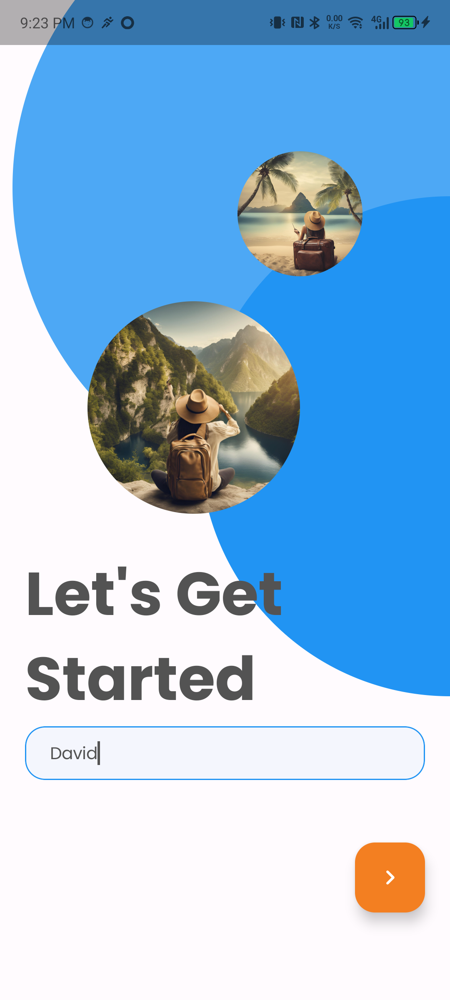

### Choose your preferences
You should select at least 1 preferences for the 3 group of preferences to receive custom travel place recommendations based on this preferences.

  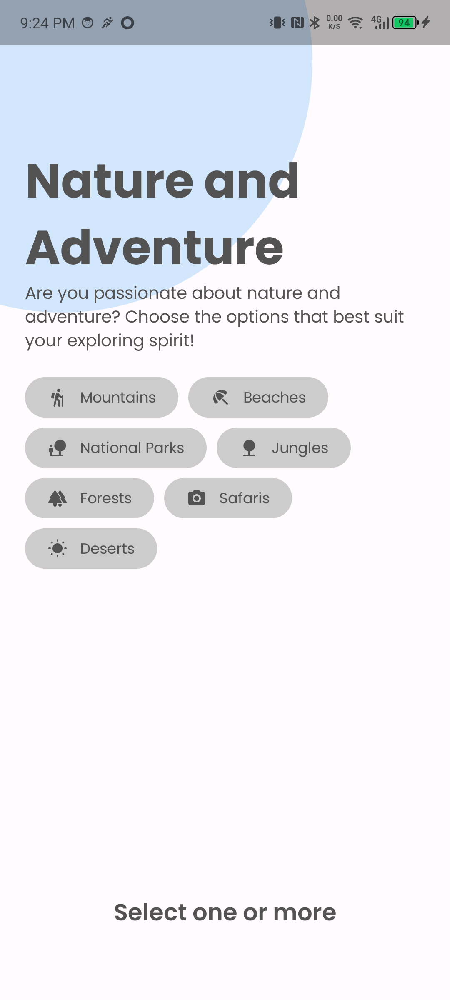
  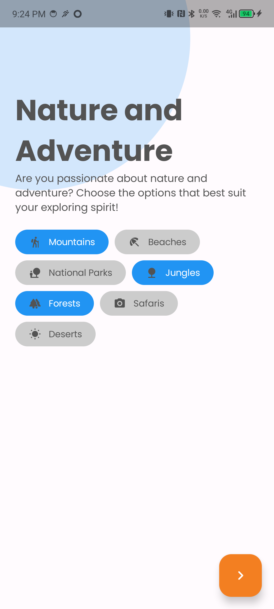
  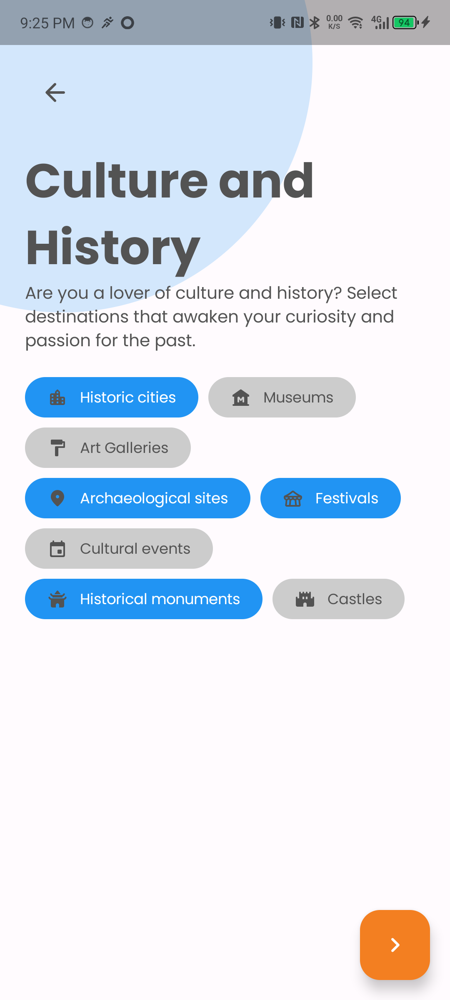
  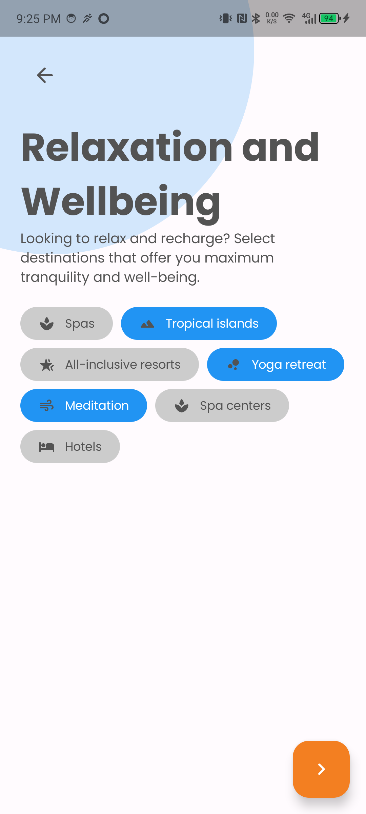

### Home - Generating recommendations
Process to generate a pull of travel place recommendations and select the location preferences for the generation

  
  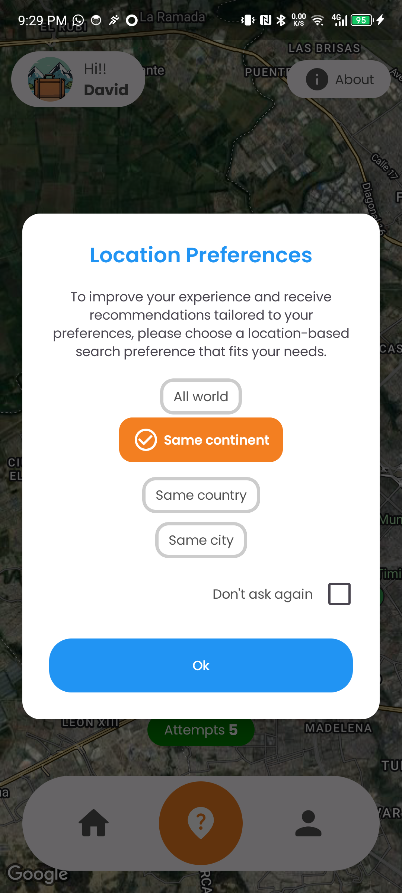
  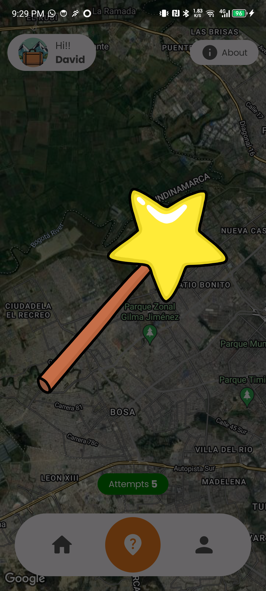
  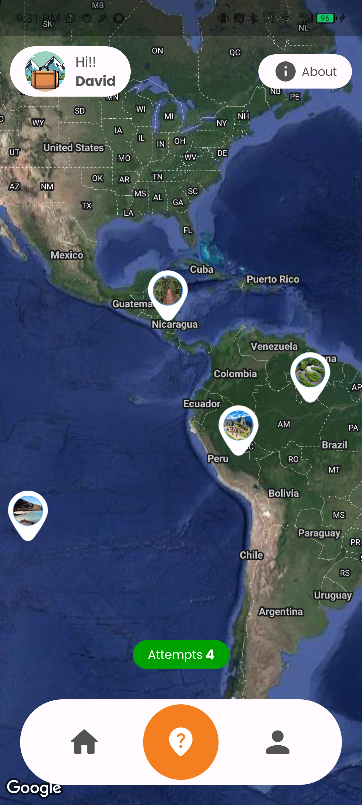

### Recommendation Details
You can save the Place as favorite, you will receive activity recommendations for the place based on your previous setup of preferences, you can delete the Place if you didn't like it.

  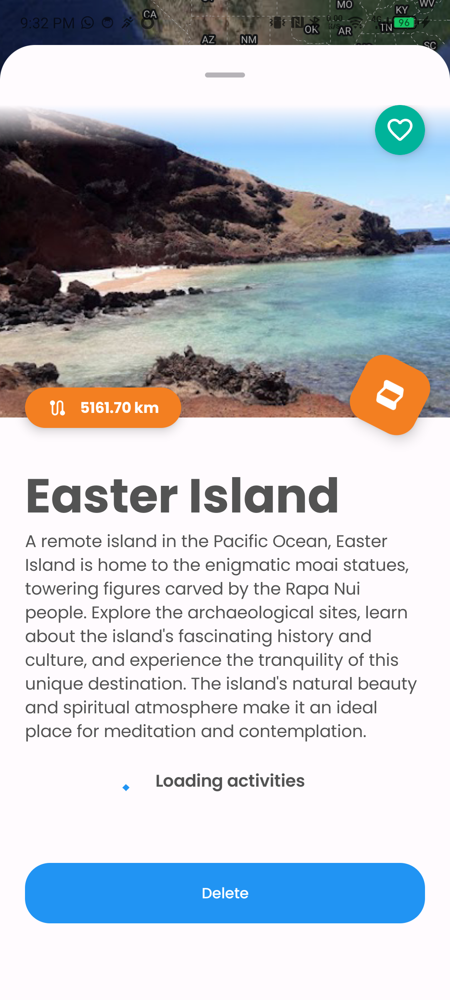
  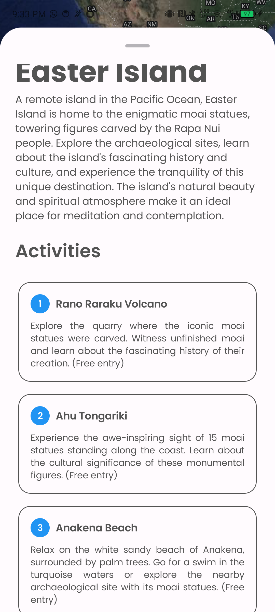
  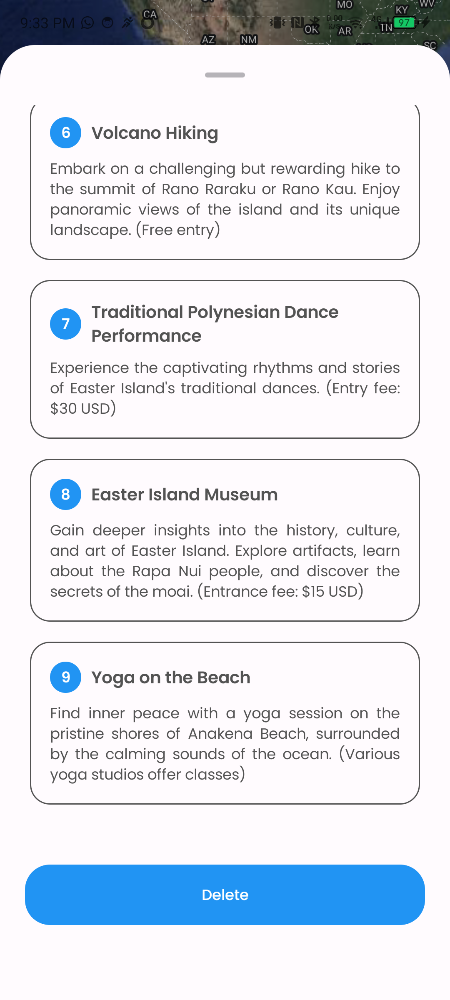

### History of Recommendations
You have access to all the travel place recommendations, filter by favorites, add some to your favorites and watch the details by clicking of some of them.

  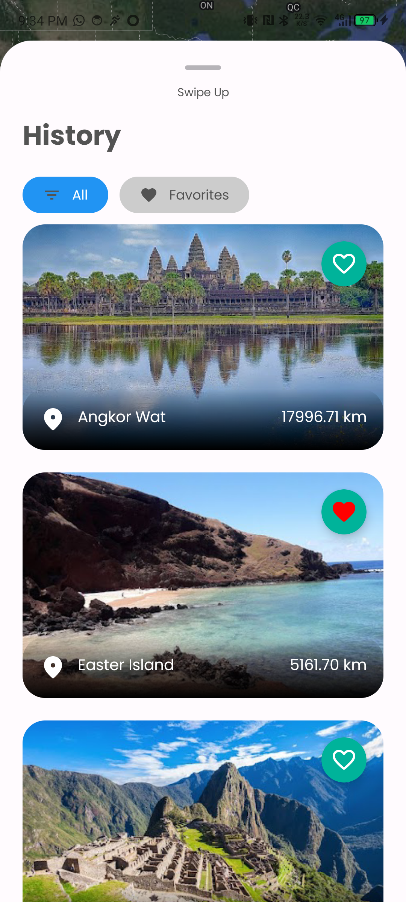
  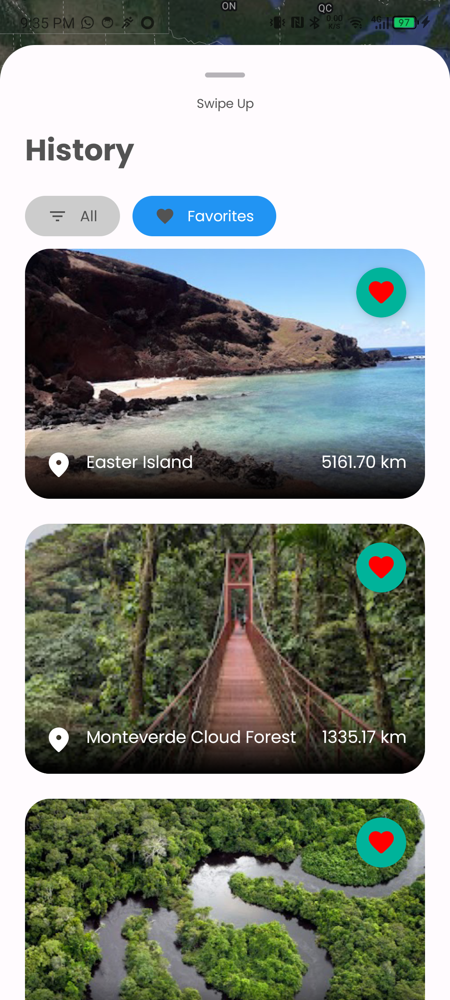

### Profile
You can review and edit your init setup of preferences, your location preferences and set up a custom api key to have unlimited travel place recommendation generation.

  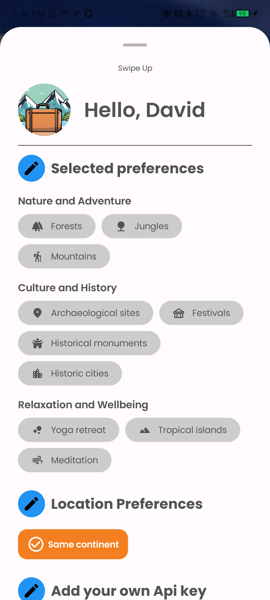
  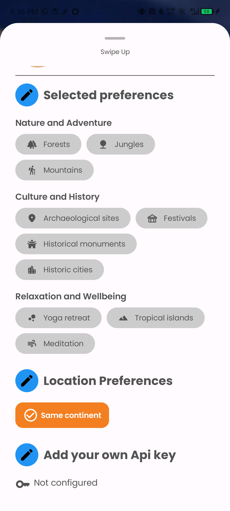

### How to add your own api key?
Type in your Api key, wait unit we verify if api key is valid to be used by the app and save it to start using it on the app with an unlimited recommendation attemps.

  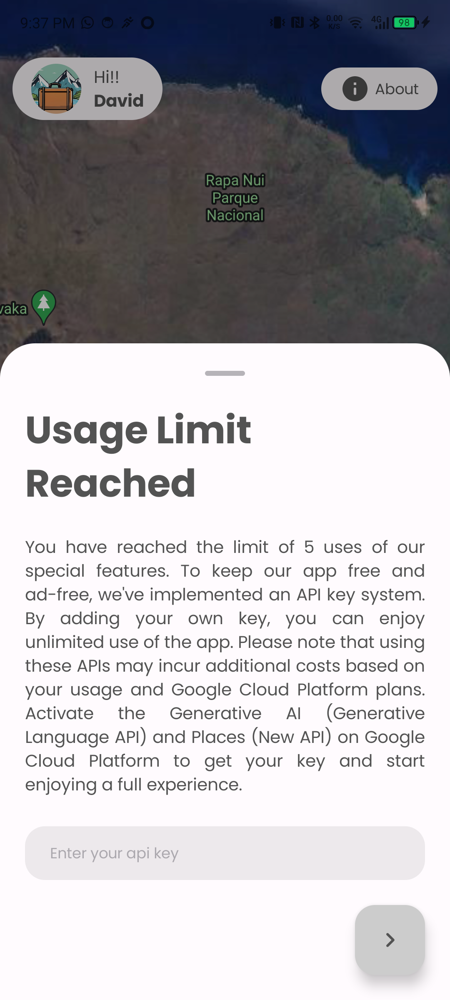
  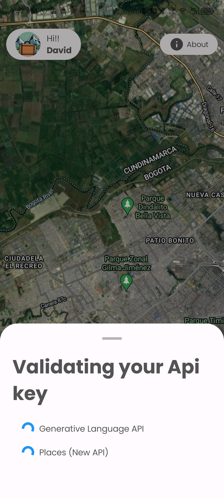
  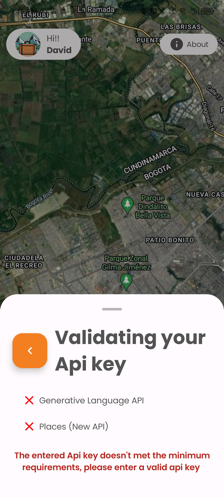
  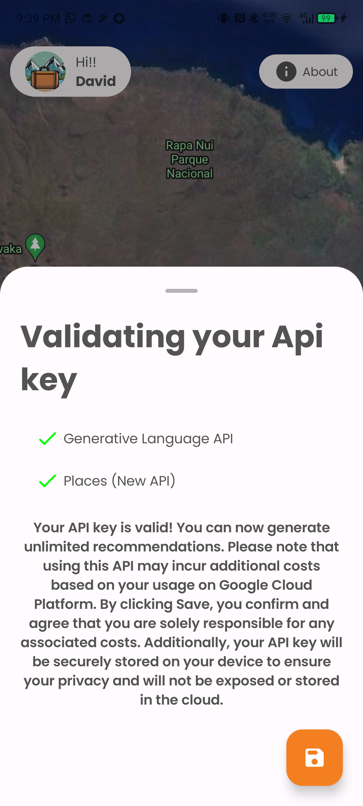

### About
Info of the app and the Development team

  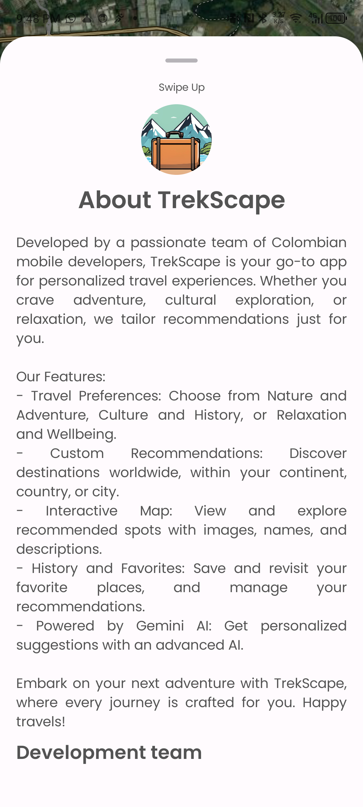
  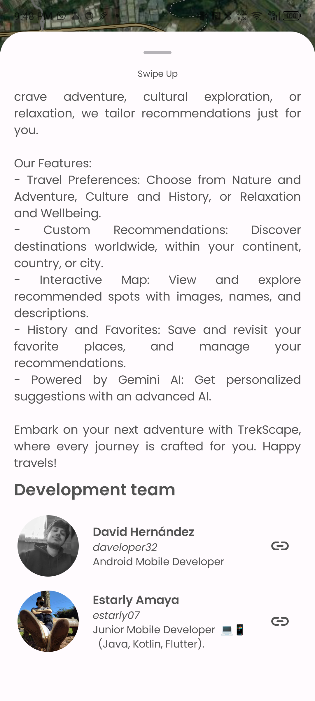

## Video Overview

[<iframe width="560" height="315" src="https://www.youtube.com/embed/VIDEO_ID" frameborder="0" allowfullscreen></iframe>](https://youtu.be/cMORfB4qEng)

